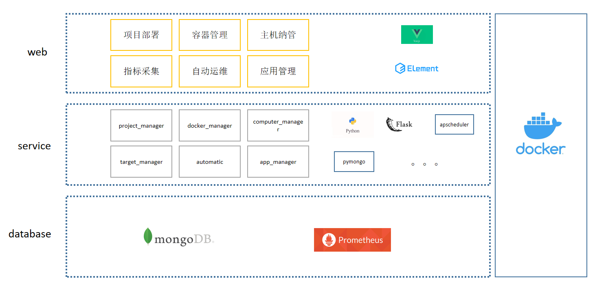
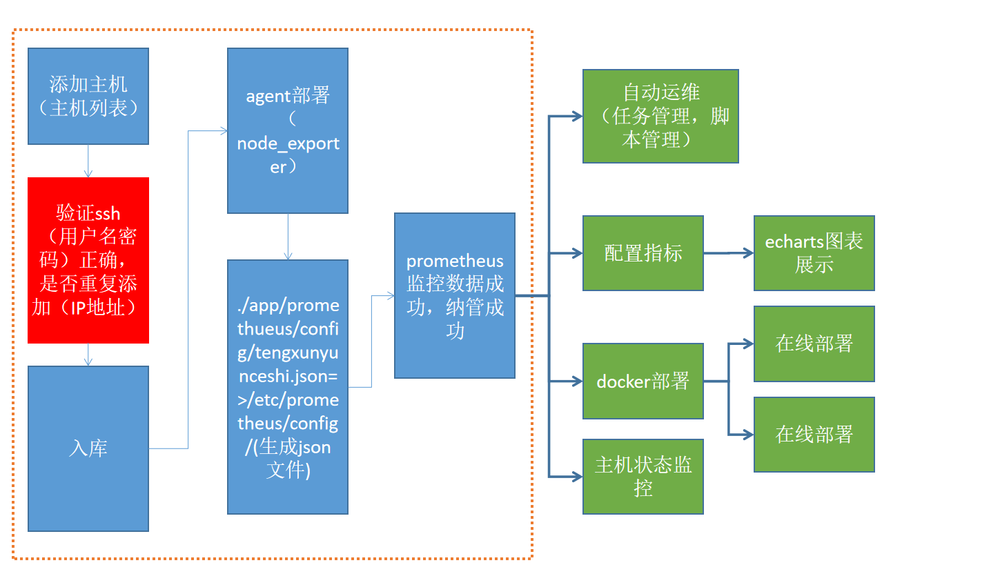

# ADo

#### 介绍

ADO(Automatic DevOps) 是基于python与vue开发的自动化运维平台。专为运维人员提供稳定、高效、安全的自动运维功能平台。
无论是个人、团队、或是企业，都能够用ado实现主机纳管、docker安装部署、指标监控，自动脚本执行等功能。
demo地址：
http://1.116.187.175:8080

#### 软件架构
软件架构说明
前端：vue+element
后端：python+flask
定时任务：apscheduler
数据库：mongodb，Prometheus
Agent：node_exporter，redis_exporter,mysql_exporter


#### 安装教程

1. 安装docker  
`centos:yum install docker`  
`ubuntu:apt-get install docker.io`  
2. clone项目：  
`git clone:`  
3. 导入镜像  
```commandline
cd ado
docker load<images/prom
docker load<images/service
docker load<images/web
docker load<images/scheduler
docker load<images/mongodb
```
4. 运行镜像：
```commandline
docker run -itd --name service -p 8090:8040 -v /data/ado:/home/project -e "local_ip='本机ip'" service
docker run -itd --name promethus -p 9010:9010 -v /data/ado/promethus/config:/etc/promethus/config/ prom
docker run -itd --name web -p 8080:80 web
docker run -itd --name ado_scheduler -e "local_ip='本机ip'" scheduler
docker run -itd --name mongo -p 27017:27017 mongo --auth
```
5. 然后访问本机地址：8080即可


#### 使用说明
整体功能图：  

1. 主机纳管功能
说明：主要是通过ip，后台通过ssh进行登录验证，在此过程中部署agent和自动登录的功能。
添加主机：
按照提示输入相关的主机信息即可进入纳管状态
2. 指标监控
已经通过纳管的主机可以查看node_exporter中所有的指标

3. docker管理部署
可以通过docker管理向目标主机安装镜像。
4. 项目部署
通过填写项目信息，集群信息，可以向多个集群主机分步骤安装相关的docker应用形成自动化部署
5. 自动运维
通过设定最小单位（service即脚本和shell），workflow（多台主机跟多种shell组合），通过task任务界面将service和workflow执行起来，可以实现定时执行或者一次执行等。

#### 参与贡献

1. 本项目诞生于2021年底，前期作者tony：陈晨，主要把1.0版本的总体框架以及前后端基本功能（主机纳管，docker管理，指标监控等）实现。
2. 目前正在开发1.2版本，主要是完善1.0的功能，使其更加稳定，并且增加自动运维相关功能，在此次1.2版本中特别鸣谢：杨海涛，王宇超，王馨颖对此次1.2版本后端功能开发的参与和完善。


