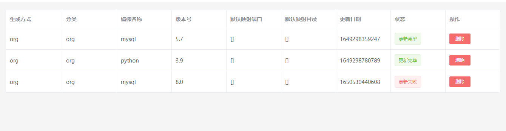

# ADo
****
#### 版本更新

5.31--------------  
增加主页dashboard展示  
5.30--------------  
本次更新是给workflow增加了step新增按钮，这边通过点击该按钮，会弹出新的页面，在新的页面里面service单选，host可以多选，点击保存即可。

****
#### 介绍

ADO(Automatic DevOps) 是基于python与vue开发的自动化运维平台。专为运维人员提供稳定、高效、安全的自动运维功能平台。
无论是个人、团队、或是企业，都能够用ado实现主机纳管、docker安装部署、指标监控，自动脚本执行等功能。
demo地址：[ADo主页](http://218.0.61.197:9080/)

***
#### 软件架构
软件架构说明
前端：vue+element
后端：python+flask
定时任务：apscheduler
数据库：mongodb，Prometheus
Agent：node_exporter，redis_exporter,mysql_exporter

***
#### 安装教程

1. 安装docker  
`centos:yum install docker`  
`ubuntu:apt-get install docker.io`  
2. clone项目：  
`git clone:`  
3. 导入镜像  
```commandline
cd ado
docker load<images/prom
docker load<images/service
docker load<images/web
docker load<images/scheduler
docker load<images/mongodb
```
4. 运行镜像：
```commandline
docker run -itd --name service -p 8090:8040 -v /data/ado:/home/project -e "local_ip='本机ip'" service
docker run -itd --name promethus -p 9010:9010 -v /data/ado/promethus/config:/etc/promethus/config/ prom
docker run -itd --name web -p 8080:80 web
docker run -itd --name ado_scheduler -e "local_ip='本机ip'" scheduler
docker run -itd --name mongo -p 27017:27017 mongo --auth
```
5. 然后访问本机地址：8080即可

***
#### 使用说明
整体功能图：  


1. dashboard  
`首页`  
主要是展示主机纳管数量，自动运维数量等，以及分类占比。  

2. 主机纳管功能  
（1）添加主机  
`主机纳管->主机列表`  
说明：主要是通过ip，后台通过ssh进行登录验证，在此过程中部署agent和自动登录的功能。通过主机列表页面点击`新增`添加对应的主机实例名称，ip地址，ssh用户名，ssh密码，以及操作初始工作区路径,点击保存即可。  

（2）主机信息查询  
`主机纳管->主机实时状态监控`  
主机添加完成后，后台会验证ssh的准确性，同时将该主机监管起来，可以在界面中查看主机的具体信息，以及当前状态。

3. 指标监控  
已经通过纳管的主机可以查看node_exporter中所有的指标  
(1)图表管理  
`指标管理->图表管理`  
可以定义需要展示的图表，例如该图表展示周期，时长
  
(2)指标配置  
`指标管理->指标定义`  
可以配置需要采集的指标，通过prometheus指标采集语句定义需要采集指标的名称映射,以及该指标需要展示在哪张图表中

（3）指标展示  
`指标管理->图表展示`  
根据在图表管理与指标配置中配置好的相关指标，进行相应的指标展示，例如cpu指标，以及内存指标等。

4. docker管理部署  
（1）新建镜像  
`docker镜像管理->新建镜像`  
一种是通过pull官方镜像，存储到系统本地，生成标签管理，另一种是通过上传dockerfile到服务器，然后dockerbuild自定义镜像，存储到本地，生成标签管理。  
  
（2）镜像列表  
`docker镜像管理->镜像列表`  
可以查看目前可以使用的镜像，以及具体的状态（如dockerbuild是否完成，pull是否完成）  
  
5. 项目部署(开发中)  
通过填写项目信息，集群信息，可以向多个集群主机分步骤安装相关的docker应用形成自动化部署，目前只支持通过配置文件生成tar包线下部署。后期会上线线上部署，将纳管的主机随时部署docker镜像以及安装。  
6. 自动运维  
  
通过设定最小单位（service即脚本和shell），workflow（多台主机跟多种shell组合），通过task任务界面将service和workflow执行起来，可以实现定时执行或者一次执行等。  
（1）运维脚本  
`自动运维->运维脚本`  
通过设置service相关的属性，如service名称，分类（shell语句还是执行脚本文件），执行语句，上传脚本文件。  
  
（2）workflow工作流  
`自动运维->workflow工作流`  
通过设置workflow相关的属性，如workflow名称，详情等，可以定义在某项task中第一步在哪台主机上执行什么，第二步在哪台主机上执行什么。  
   
  
（3）task定时任务  
`自动运维->定时任务`  
通过设置task的执行周期（一次，或者定时，或者循环多次），来执行workflow或者service。  
  
***
#### 参与贡献

1. 本项目诞生于2021年底，前期作者tony：陈晨，主要把1.0版本的总体框架以及前后端基本功能（主机纳管，docker管理，指标监控等）实现。
2. 目前正在开发1.2版本，主要是完善1.0的功能，使其更加稳定，并且增加自动运维相关功能，在此次1.2版本中特别鸣谢：杨海涛，王宇超，王馨颖对此次1.2版本后端功能开发的参与和完善。


